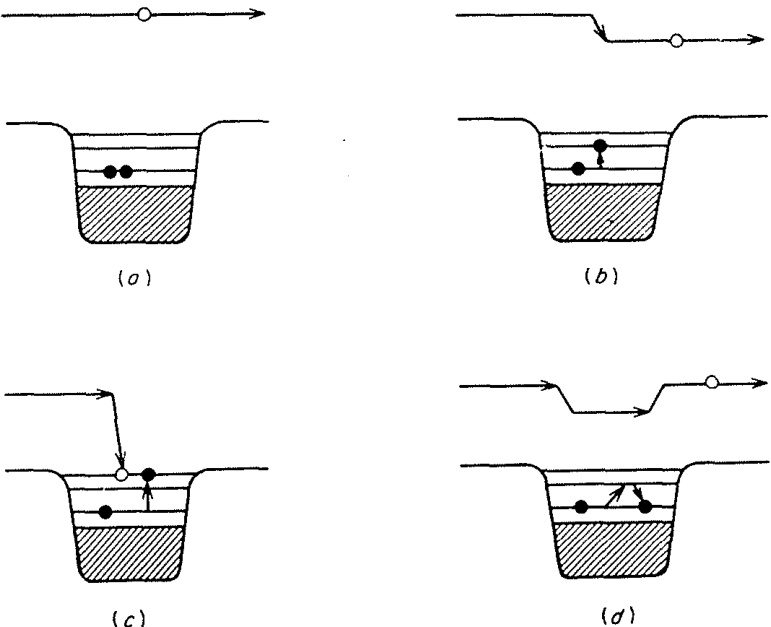

# 1.2. 直接反应的定义 (The definition of direct reactions)
### 1.2.1 简洁性 (Simplicity)

如何定义直接反应的问题并没有一个明确的答案。Austern（1970）对此进行了全面的回顾与探讨。然而，从定性角度来看，其核心概念是明确的：当入射通道与出射通道的波函数之间存在明显的重叠时，碰撞往往仅涉及少量核子的重新排列；这一过程通常迅速完成，并被称为直接反应（direct reaction）。这种情况通常被认为只涉及少数自由度（degrees of freedom），但这一表述需要谨慎使用。它依赖于所采用的表象，如果用集体模型描述，集体振动（collective vibration）可以非常简单，甚至可能仅涉及一个坐标；而若用壳模型（shell model）描述，则可能涉及许多独立粒子激发的关联叠加。因此，初态与末态波函数之间良好重叠的概念意味着，在适当的表象下，只需要很少的自由度。

最典型的直接相互作用情形是弹性散射（elastic scattering），在这种情况下，初始和最终的波函数相同（除了自旋取向可能发生改变）。弹性散射的直接分量，也称为形状弹性（shape-elastic）分量，通常占主导地位，并引出了光学模型（optical model）的概念。光学模型与束缚态的壳模型之间存在密切的类比关系。在壳模型中，通过引入粒子间的剩余相互作用（residual interactions）来修正计算结果；有时采用微扰理论（perturbation theory），有时则在有限基组内进行对角化。类似地，剩余相互作用也被用来修正光学模型，这些修正包括非弹性散射（inelastic scattering）和重排碰撞（rearrangement collisions）。这两种计算方法同样被广泛使用。此外，束缚态理论和散射态理论还有一个共同特征，即它们都以原子核及其相关的光学模型和壳模型势的形式包含集体运动（collective motions）。

### 1.2.2 一个示例模型 (An Illustrative Model)

为了教学目的，我们考虑一个简单的示例模型，用以展示反应过程中各步骤的物理特性。使用壳模型语言（即独立粒子态）进行讨论最为直观，但其他描述核激发的简单方法（如集体振动）也同样适用。

在壳模型中，核子间的平均相互作用由单体势 $ {U}_{\text{SM}} $ 表示，而围绕该平均值的涨落则由两体“剩余相互作用 (residual interactions)” $ V_{\text{res}} $ 描述。（这里我们不关注这些相互作用与实际核子-核子相互作用之间的关系，也不涉及 $ {U}_{\text{SM}} $ 和 $ V_{\text{res}} $ 的精确定义。）在这个模型中，入射核子具有正能量，并受到相同的相互作用作用：

$$
V = U_{\text{SM}} + V_{\text{res}},
$$

最简单的过程是入射核子被平均势散射，而靶核中的核子不受干扰，如图 1.1(a) 所示。在这种情况下，光学势 (optical potential) 可以近似等同于（实）壳模型势 (shell-model potential)，即 $ U_{\text{OM}} \approx U_{\text{SM}} $。接下来考虑 $ V_{\text{res}} $ 的一次作用：靶核中的某个核子可能被激发，导致入射核子的能量降低，如图 1.1(b) 所示。这是非弹性散射的一个简单例子，末态与初态的波函数有良好的重叠。这种过程仅在一个核子的状态上发生变化，并且可以通过 $ V_{\text{res}} $ 的单次作用实现。显然，这应被视为一种直接反应。

  
图 1.1. 核子撞击原子核时可能发生的一些过程的示意图。阴影区域代表填充的壳层；实心点代表两个价核子。

入射核子实际上可能被俘获（如图 1.1(c) 所示），从而形成一种亚稳态——即所谓的“连续谱中的束缚态”（bound state embedded in the continuum，Mahaux 和 Weidenmüller, 1969）。当能量条件恰到好处时，这种过程会导致共振截面（resonant cross section）的出现。

值得注意的是，如果图 1.1(b) 中入射核子的能量使其最终处于 $ U_{\text{SM}} $ 势阱中的一个尖锐单粒子散射共振（single-particle scattering resonance），它同样会表现出共振行为。不过，这种情况通常仅在能量非常低时发生。

这些亚稳中间态具有复合系统的双粒子单空穴（two-particle, one-hole）激发特征。近年来，将它们称为“通道态”（doorway states）已成为一种趋势。这些态是通向任何更复杂激发的第一步，也可以被视为从简单到复杂激发的桥梁。

显然，这一过程可以继续发展。如果 $ V_{\text{res}} $ 再次作用，另一个靶核子可能被激发，依此类推。然而，在深入探讨之前，我们先考虑其他可能性。最简单的情形是，$ V_{\text{res}} $ 的第二次作用恰好逆转了图 1.1(b) 中的过程，从而导致图 1.1(d) 所示的情况。这种情况对应于弹性散射。

如果我们希望在光学模型中包含这类贡献，则必须向 $ U_{\text{SM}} $ 添加一项：
$$
U_{\text{OM}} = U_{\text{SM}} + \Delta U.
$$
这个贡献 $ \Delta U $ 具有两个重要特性：**非局域性**（nonlocal）和**能量依赖性**（energy dependent）。所谓非局域性，是指核子在位置 $ r $ 处离开入射通道后，可能在另一位置 $ r' $ 返回；而能量依赖性则体现在两次碰撞之间核子的传播行为会随能量变化。是否能够或有必要将 $ \Delta U $ 纳入模型，取决于其具体性质。我们通常倾向于用简单的模型势来描述 $ U_{\text{OM}} $，并希望其最多仅具有平滑的能量依赖性。然而，如果像图 1.1(d) 中那样的高阶贡献包含共振行为，则可能难以满足这一要求。

通常情况下，存在许多类似于图 1.1(d) 的跃迁过程。如果这些跃迁的数量足够多，使得它们的总体效应随能量平滑变化，那么我们可以通过扩展 $ U_{\text{OM}} $ 来包含这些贡献。然而，在轻核体系中，特别是在较低能量下，可用的构型数量较为有限。因此，我们观察到的至少部分共振现象具有“通道态”的特性。在这种情况下，唯一令人满意的方法是明确求解由 $ V_{\text{res}} $ 耦合的弹性散射和束缚态方程（基于 $ U_{\text{SM}} $）。相关研究可参考文献（例如，Feshbach, Kerman, and Lemmer, 1967；Mahaux and Weidenmüller, 1969）。

顺便提一句，这种情况凸显了过于简单化定义“直接反应”和“复合核反应”所带来的风险。在这里，我们可能会观察到相当尖锐的共振现象，这些共振与整个系统或“复合核”的亚稳态相关。然而，由于这些态的特性相对简单（仅出现在 $ V_{\text{res}} $ 的二阶效应中），它们也可以被视为直接反应的一部分。

当图 1.1(d) 中的中间态不衰变回弹性通道，而是衰变到非弹性通道或更复杂的激发时，就会导致入射通道通量的损失。这种吸收效应（absorption）可以通过在 $ \Delta U $ 中引入虚部来描述。之前的讨论同样适用于这一情况：如果存在多种可能的衰变模式，吸收行为通常会随能量平滑变化；但如果可能的衰变模式较少，则可能出现共振行为，此时需要对 $ V_{\text{res}} $ 进行更细致的分析和处理。

### 1.2.3 ‘直接’与‘复合’ ('Direct' versus 'compound')

类似于之前讨论的情况，类似的分析方法也可以应用于非弹性跃迁。像图 1.1(b) 所示的事件显然是直接反应，而那些 $ V_{\text{res}} $ 作用两次（如图 1.1(d)）或仅作用少数几次的事件，由于其过程相对简单，可以归类为“直接 (direct)”反应，或者至少是“半直接 (semidirect)”反应。这些过程既可以通过微扰理论进行计算，也可以通过求解相关的耦合方程（coupled equations）来处理。

那么，界限在哪里？一个过程需要变得多复杂才不再适合被称为“直接”？关键问题与其说是相互作用作用了多少次，不如说是涉及了多少自由度或简正运动模式。例如，我们可以求解一对耦合方程，用于描述从靶核基态到一个声子态（one-phonon state）的散射；尽管相互作用被考虑到了所有阶，但只涉及一种（振动）核运动模式。这种情况显然值得被称为“直接”反应。

即使在理论模型中明确考虑了通道之间的复杂耦合（即多个通道之间存在直接关联），这种情况通常也仅限于那些彼此具有简单结构关系的原子核之间的通道。换句话说，只有当涉及的原子核在结构上相对简单（例如，质量数相近或激发模式类似）时，这种耦合效应才容易被描述和处理。

然而，随着入射能量逐渐扩散到更复杂的运动模式（例如更多的内禀激发或更复杂的核子重组），系统的动态行为会变得更加复杂。此时，我们才真正进入了描述聚变和复合核形成的路径。在这种情况下，反应不再局限于简单的通道耦合，而是涉及到整个核系统的全局变化。

在我们一直讨论的直接反应中，通量确实会通过吸收性光学势（absorptive optical potentials）和有效相互作用（effective interactions）的虚部不断流失。这种流失反映了通量从直接反应通道向更复杂状态的转移。最初的“门道”是弹性散射，其中形状弹性（shape-elastic）部分构成了直接分量。在此阶段，被吸收的部分通量会迅速重新出现在其他直接反应通道中，但其中一部分因耦合到更复杂的激发而逐渐流失。

上述图景还有一个重要后果。那些通过许多复杂中间态但最终回到入射（弹性）通道或低激发通道之一的高阶贡献，平均而言，很可能与主要的直接或低阶贡献是非相干的（incoherent）。如果可能的中间态数量足够多，这些多步项倾向于具有随机相位，因此干涉效应平均而言会趋于抵消。这些项可以用统计方法处理（例如，参见 Vogt, 1968）。由此，我们得出结论：总截面可以视为直接反应截面与“复合核”截面的非相干叠加。除非在低能量下，若跃迁在一阶或低阶是允许的，则由于复合系统衰变开放的许多其他通道的竞争，复合贡献预计会很小甚至可以忽略不计。

当然，“直接反应”和“复合核反应”之间从来没有明确的界限，试图划定这样的界限是徒劳的。这两种标签是为了强调核碰撞过程中不同方面而发明的理论产物。在实践中，两者之间存在灰色区域。近年来关于预平衡（preequilibrium）或预复合反应（precompound reactions）的研究（例如，Feshbach, Kerman, and Koonin, 1980 的综述）正是针对这些问题展开的。

对极重离子之间反应的研究进一步强调了这一点，并揭示了一种新型反应：深度非弹性散射（deep-inelastic scattering）（近期综述可参见 Bass, 1980）。这种反应涉及大量相对运动动能转化为内禀激发能，末态数目众多（在微观层面）。尽管如此，反应相对较快，角分布在掠射碰撞（grazing collisions）角度附近可能会急剧峰化，并且两个初始核在某种程度上保持其特性，仅有少量核子在它们之间转移。因此，它具有一些“直接”反应的特征。

### 1.2.4 能量平均与“直接”的定义 (Energy-averaging and the definition of 'direct')

典型的核碰撞是一个复杂且强相互作用的多体过程，可能涉及大量的自由度。为了更好地理解这一点，我们可以回顾第 1.2.2 节中的示例模型：在这一模型中，靶核可能发生许多不同形式的激发，而剩余相互作用 $ V_{\text{res}} $ 可能在不同阶次上起作用。例如，一次简单的激发可能只涉及一个核子的状态变化（如单粒子激发），但随着能量增加，可能会出现多个核子的重新排列或更复杂的集体振动模式。这种复杂性使得任何特定的跃迁振幅 $ T $ 都可以被视为由大量项组成，其中大多数项随轰击能量快速变化。

我们之前提到过，**直接反应的特点是其简单性**，即它仅涉及少数自由度。然而，如何将这一特点与实际核碰撞的复杂性联系起来？一种常见的方法是引入对某个能量区间的平均处理。

在研究低能中子截面时，光学模型的应用通常需要进行能量平均。这是因为这些截面往往表现出许多尖锐的共振峰。即使在存在大量重叠共振的情况下，原则上仍然需要通过能量平均来描述系统的整体行为。

具体来说，跃迁振幅 $ T $ 可以被分解为两部分：
1. **能量平均值 $ \overline{T} $**：这是对某一能量区间内的平均贡献，反映了系统的主要趋势。
2. **涨落部分 $ T_{\text{fluc}} $**：这是围绕平均值的波动，其均值为零，代表了局部的、快速变化的细节。

用公式表示为：
$$
T = \overline{T} + T_{\text{fluc}}, \quad \langle T_{\text{fluc}} \rangle = 0.
$$

一些作者（例如 Mahaux 和 Weidenmüller, 1979；Feshbach 等, 1980）提出了一种定义：将 $ \overline{T} $ 称为**直接反应振幅**，而将 $ T_{\text{fluc}} $ 称为**复合核振幅**。这种定义具有以下优点：
1. **干涉项消失**：由于 $ T_{\text{fluc}} $ 的均值为零，在能量平均后，直接反应和复合核反应之间的干涉项会自动消失。
2. **缓慢变化的特性**：直接振幅 $ \overline{T} $ 随能量的变化较为缓慢，这与直接反应的时间尺度较短（即反应发生得较快）相一致。

然而，这种定义虽然理论上有吸引力，但在实践中却面临一些困难。Austern（1970）指出，直接将这一定义与实验中常用的方法建立一一对应关系并不容易。最接近的理论框架可以在 Feshbach 等（1980）的工作中找到。

在实际研究中，科学家们通常不会试图给“直接反应”一个严格的精确定义，而是采用更具启发性的方法。他们通过构建简单的动力学模型来探索核反应的行为。这些模型的选择通常基于以下几点：
1. **波函数的约束**：模型的选择涉及对总波函数的部分施加约束，而不是直接对跃迁振幅施加约束。例如，某些模型可能只考虑少量的激发态或特定的自由度。
2. **有效相互作用**：在这些模型中使用的相互作用是所谓的“有效相互作用”（见第 2.9 节）。这些相互作用原则上体现了系统与其他自由度的耦合效应（例如，通过虚部反映吸收效应）。
3. **隐式平均**：尽管这些模型中的相互作用矩阵元被假定为简单，但它们实际上代表了真实耦合的某种平均值。换句话说，模型中的相互作用已经隐含地包含了对复杂性的平均处理。

从理论上讲，通过对能量区间进行平均，可以将跃迁振幅分解为直接反应振幅 $ \overline{T} $ 和复合核振幅 $ T_{\text{fluc}} $。这种定义为直接反应提供了一个形式上的框架，但也存在局限性：如何将其与实验中常用的分析方法建立明确的对应关系并不总是显而易见。

在实际研究中，科学家们更倾向于使用启发式的模型方法。这些模型通过对波函数施加约束并引入有效相互作用，能够在一定程度上捕捉到核反应的本质特征。虽然这种方法可能缺乏严格的理论基础，但它在实践中被证明是非常有效的。

### 1.2.5 波函数模型 (Wavefunction Models)

Austern（1970）提出了一种形式体系，并对其进行了广泛讨论。在这一理论框架中，总波函数被分解为两个部分：闭合部分和开放部分：
$$
\Psi(E) = \Psi_{\text{closed}}(E) + \Psi_{\text{open}}(E),
$$
其中，闭合部分 $ \Psi_{\text{closed}}(E) $ 在空间上局限于两个核碰撞区域周围，但在外部逐渐消失；而开放部分 $ \Psi_{\text{open}}(E) $ 则描述了远离碰撞区域的行为，包括入射和出射通量。

要给出这两部分的精确定义，通常需要指定一个特定的表象。然而，对于定性讨论来说，这种具体定义并非必要。

闭合部分 $ \Psi_{\text{closed}}(E) $ 的主要特征是它在空间上局限于两个核碰撞点附近，并在远处迅速衰减。因此，闭合部分不携带任何通量。用第 1.2.2 节的示意模型（它代表了一种表象选择）来说，$ \Psi_{\text{closed}}(E) $ 包含了所有复杂的多粒子激发态，其中没有任何一个核子处于连续谱中。换句话说，这些状态对应于复合核的内部激发。

特别重要的是那些零阶能量为正且接近当前反应能量 $ E $ 的构型。这些构型被称为“连续谱中的束缚态”（bound-states-in-the-continuum）。它们的存在使得 $ \Psi_{\text{closed}}(E) $ 能够表现出共振行为。例如，当某个多粒子激发态的能量与入射粒子的能量非常接近时，可能会出现尖锐的共振峰。

开放部分 $ \Psi_{\text{open}}(E) $ 描述了未局限于碰撞区域的部分波函数，因此它包含了远距离处的入射和出射通量。直接反应模型的核心在于：它提供了 $ \Psi_{\text{open}}(E) $ 各部分之间的直接耦合，而无需显式地涉及 $ \Psi_{\text{closed}}(E) $。尽管如此，$ \Psi_{\text{open}}(E) $ 在相互作用区域内的结构仍然复杂，原因有以下两点：
1. **各部分之间的耦合**：$ \Psi_{\text{open}}(E) $ 的不同分量之间存在复杂的相互作用。
2. **与闭合部分的耦合**：$ \Psi_{\text{open}}(E) $ 也通过间接方式与 $ \Psi_{\text{closed}}(E) $ 发生耦合。

为了简化这种复杂性，在实际计算中，科学家们通常使用**有效相互作用**（effective interactions），通过平均的方式表示这些耦合的影响。例如，光学模型势（optical-model potentials）就是一种常见的有效相互作用形式。

此外，一个特定的模型通常只明确关注 $ \Psi_{\text{open}}(E) $ 的一小部分。由于模型空间有限，不可避免地会有一部分通量流失到未包含在模型中的其他开放通道中。这种通量损失可以通过引入**虚部的吸收性相互作用**（imaginary, absorptive interactions）来解释。这些吸收性相互作用以平均的方式描述了从模型空间到其他开放通道的通量流失，无论是直接发生还是通过闭合部分间接发生。

在实践中，直接反应的计算更侧重于平均的有效相互作用（如光学模型势），而不是平均的跃迁振幅。这是因为相互作用和跃迁振幅之间的关系是非线性的，很难将这种方法与上一节中描述的能量平均方法精确联系起来。然而，这两种方法背后的物理概念是非常相似的。

总的来说，在本书的后续部分中，我们将把直接反应理论视为一种**启发式方法**。这种方法的核心在于构建模型波函数，并通过分析其行为和后果来探索核反应的特性。在此过程中，我们不断根据实验数据的反馈对模型进行改进和优化。通过这种迭代的方式，我们可以逐步揭示核反应背后的本质规律。

