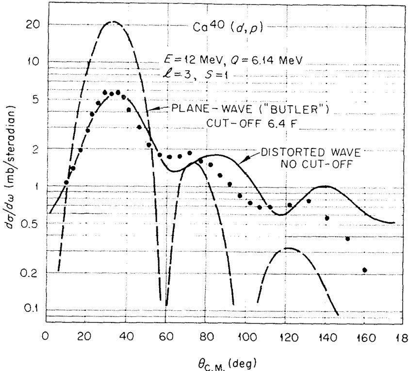
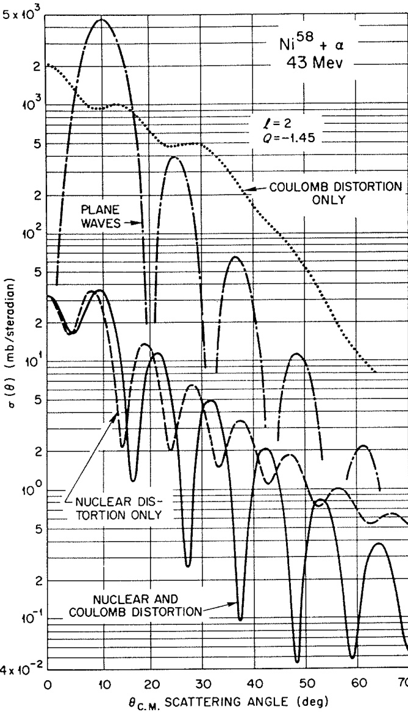
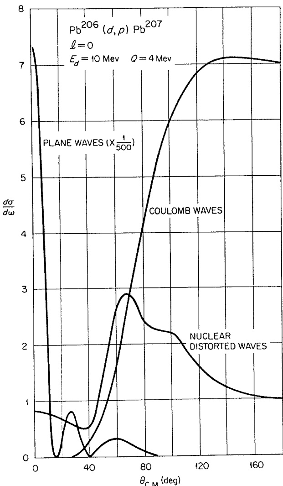
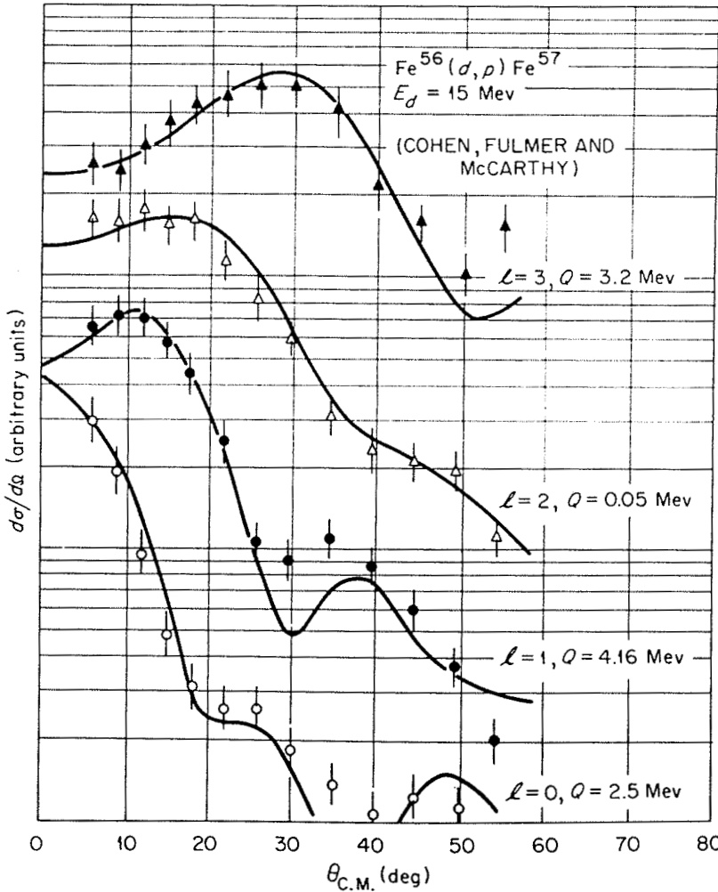
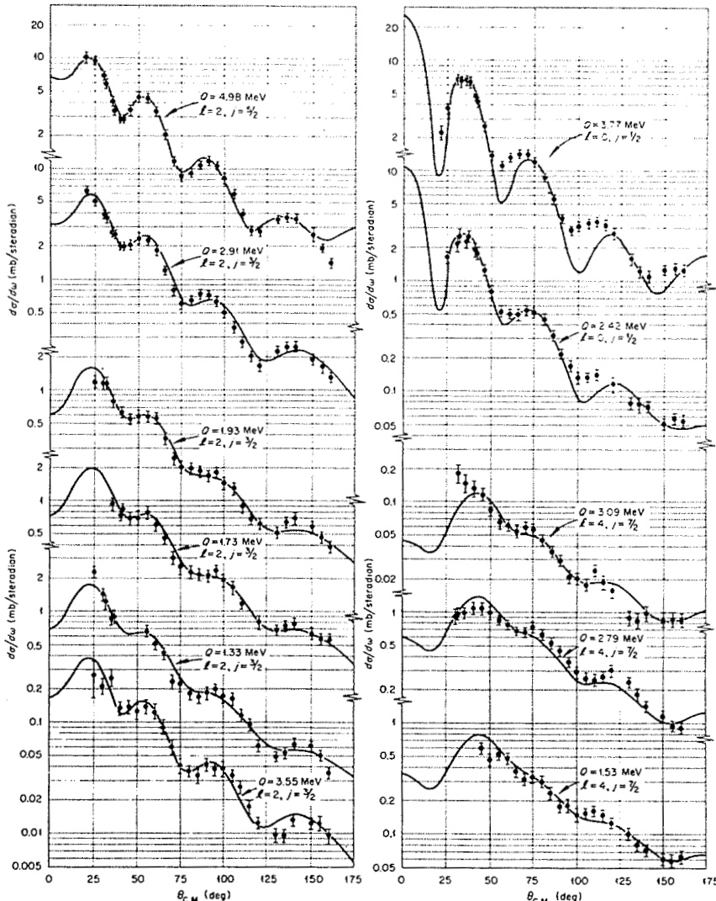
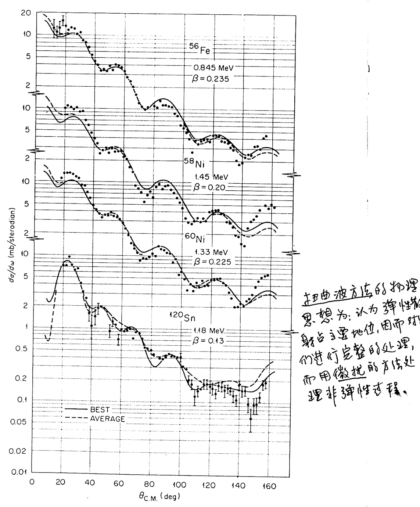

# 1.5. 扭曲波理论 (Distorted-wave theories)

扭曲波理论（Distorted-wave theories）的核心假设是：**弹性散射**是两个原子核碰撞时发生的最重要的单一事件。这里的弹性散射不仅包括传统的弹性过程，还涵盖了吸收的概念。所谓吸收，是指通量被移除到许多其他反应通道中。这些通道单独来看可能并不重要，但总体上可能导致入射通量在核内部完全消失（即强吸收现象）。为了描述这种复杂的耦合效应，可以通过引入复光学势（complex optical potential）以平均化的方式表示这些众多的耦合。

这一方法隐含了两个关键假设：
1. 与单个反应通道的耦合较弱；
2. 这些通道之间没有强烈的关联。

第二个假设的破坏可能是近年来在重离子诱发转移反应中遇到一些困难的原因。

基于上述物理假设，我们首先尝试精确地描述弹性散射（在简单光学模型的框架内），然后将其他反应视为微扰，或看作弹性散射态之间的跃迁。

在扭曲波玻恩近似（DWBA）中，跃迁振幅从玻恩近似的形式（方程 (1.7)）推广为以下形式：
$$
T_{\mathrm{DWBA}} = \int \chi^{(-)}(\mathbf{k}_b, \mathbf{r}_b)^* (\psi_B \psi_b | V | \psi_A \psi_a) \chi^{(+)}(\mathbf{k}_a, \mathbf{r}_a) \mathrm{d}\mathbf{r}_a \mathrm{d}\mathbf{r}_b,
$$
其中：
- $\chi(\mathbf{k}, \mathbf{r})$ 是扭曲波（distorted waves），用于描述相应的弹性散射；
- 其形式为：
$$
\chi(\mathbf{k}, \mathbf{r}) = e^{i\mathbf{k} \cdot \mathbf{r}} + \psi_{\mathrm{scatt}},
$$
其中 $\psi_{\mathrm{scatt}}$ 是散射波部分。

扭曲波通常通过使用光学势生成，这些光学势的参数经过调整以拟合在适当能量下观察到的弹性散射数据。

与平面波情况不同，两个扭曲波无法像方程 (1.8) 那样简单地组合，因此 $T_{\mathrm{DWBA}}$ 也无法简化为显式的简单形式。然而，其基本物理仍然是相同的。由于散射波的存在，动量分量（大小和方向）不再仅由 $\mathbf{k}$ 决定。因此，$T_{\mathrm{DWBA}}$ 可以被视为 $T_{\mathrm{BA}}$ 在动量分布上的积分。实际上，一种评估 DWBA 振幅的技术正是基于这种方法。

尽管如此，动量和角动量守恒的基本要求仍然存在，只是与简单的平面波极限相比，它们的影响可能被弥散了。

虽然截面对多极性（或角动量转移 $l$）的依赖性不再能用诸如贝塞尔函数之类的简单通用形式来表达，但需要强调的是，扭曲波程序原则上是明确无误的，并且应该能够明确识别 $l$ 值。（当然，在实践中，由于光学势的不确定性，可能会存在一定模糊性。）

在许多情况下，扭曲波理论的效果非常好。以下是两个典型的应用示例：

图 1.4 展示了一个早期应用于氘核剥裂反应的例子。DWBA 曲线假设 $^{40}\mathrm{Ca}$ 是一个双闭壳核进行计算，结果与观察到的截面大小一致。相比之下，巴特勒的平面波理论（通过选择 $R = 6.4 \, \mathrm{fm}$ 以匹配主峰位置）高估了峰值截面约 4 倍，并且给出的角分布随角度增加下降过快。虽然在这种情况下 DWBA 的“拟合”并不完美，但它是一个显著的改进。

图 1.5 展示了另一个早期应用于 $\alpha$ 粒子非弹性散射的例子。该图分别显示了由库仑相互作用、特定核相互作用（由复光学势表示）以及它们的组合效应引起的畸变效应，即方程 (1.13) 中的 $\psi_{\mathrm{scatt}}$ 项。（虽然未显示测量的截面，但后者的结果与实验数据吻合良好。）

平面波曲线是通过调整半径 $R$ 以匹配完整 DWBA 曲线的第一个峰获得的。所有曲线均采用相同的归一化。可以看出，畸变效应显然非常重要。

扭曲波理论通过引入复光学势成功地描述了核反应中的强吸收效应，并将其他反应视为弹性散射态之间的跃迁。尽管 DWBA 的数学形式比平面波近似复杂得多，但其物理基础清晰且广泛适用。通过实际应用可以看出，DWBA 在解释实验数据方面表现出显著优势，尤其是在处理氘核剥裂和 $\alpha$ 粒子非弹性散射等复杂反应时。

  
图 1.4 展示了在 12 MeV 氘核轰击 $^{40}\mathrm{Ca}$ 核时，$(d,p)$ 反应的截面预测结果。该图对比了以下两种理论模型的预测：
1. **平面波理论**：假设入射粒子和出射粒子均为未受扰动的平面波。
2. **扭曲波理论**：考虑了弹性散射和吸收效应，通过复光学势生成扭曲波。

此外，图中还标注了不同理论所使用的“截断半径”（对应公式 (1.6) 中的半径 $R$）。实验测量数据（由 Lee 等人于 1964 年提供）以点的形式呈现，用于验证理论预测的准确性。

从图中可以看出：
- **平面波理论**高估了峰值截面，并且其角分布随角度增加下降过快，无法很好地拟合实验数据。
- **扭曲波理论**的结果与实验数据吻合良好，显著改进了平面波理论的不足之处。

当轰击能量接近库仑势垒时，库仑场对平面波的畸变效应变得非常重要。图 1.6 进一步说明了这一点，展示了在这种情况下平面波理论和库仑波理论预测的截面差异。

1. **平面波理论与库仑波理论的差异**：
   - 在低能条件下，库仑场对入射粒子的轨迹产生了显著的偏转效应。
   - 平面波理论完全忽略了这种效应，因此其预测结果与实际情况存在巨大偏差。
   - 相比之下，库仑波理论通过引入库仑相互作用部分地修正了这一问题。

2. **特定核相互作用的重要性**：
   - 除了库仑场的影响外，特定核相互作用（由复光学势描述）引起的散射和吸收效应也非常重要。
   - 这些效应进一步改变了预测的截面分布，使其更接近实验观测值。

3. **实验验证**：
   - 实验测量数据证实了上述理论分析的正确性。库仑场和核相互作用的综合效应在低能条件下尤为显著。

通过对图 1.4 和图 1.6 的分析可以看出：
- 扭曲波理论能够有效地描述低能条件下的核反应过程，特别是在考虑库仑场和核相互作用的复杂效应时。
- 平面波理论由于忽略了这些效应，在低能条件下表现较差，无法准确预测实验结果。
- 实验数据为扭曲波理论提供了强有力的支持，证明了其在实际应用中的优越性。

  
图 1.5. 库仑势和核势对$\alpha$粒子非弹性散射造成的畸变效应。所有曲线都以相同的方式归一化。(来自 Rost 1962。) 

  
图 1.6. 当轰击能量接近库仑势垒时，库仑和核畸变对氘核剥裂反应的影响。

  
图 1.7 展示了通过氘核剥裂反应的角分布形状来识别转移角动量 $l$ 的过程。图中的曲线代表基于扭曲波理论的计算结果（数据来源：Cohen, Fulmer, and McCarthy, 1962）。 

由扭曲波方法计算得到的角分布仍然能够清晰地反映出角动量转移的特征。如图 1.7 所示，转移中子的角动量 $l$ 值可以通过分析角分布的形状明确识别出来。这一特性使得扭曲波方法在研究核反应中的角动量转移时具有重要的应用价值。

  
图 1.8 展示了在 12 MeV 氘核轰击 $^{90}\mathrm{Zr}$ 核的 $(d,p)$ 反应中，实验测量值与使用扭曲波方法计算的截面之间的比较。（数据来源：Dickens, Perey, and Silva, 1967。）

图 1.8 展示了在 12 MeV 氘核轰击 $^{90}\mathrm{Zr}$ 核的 $(d,p)$ 反应中，不同角动量转移（$l = 0$、2 和 4）的典型例子。这些结果进一步说明了扭曲波方法的优势：
- **全角度范围的拟合能力**：扭曲波理论能够在整个角度范围内很好地拟合实验数据。
- **角动量分辨能力**：通过分析角分布的特征，可以明确区分不同的角动量转移值。

  
图 1.9 包含了多个靶核在 30 MeV 质子非弹性散射中的实验数据，其中角动量转移为 $l = 2$。这些结果显示了扭曲波方法在处理质子非弹性散射问题时同样具有很高的精度和适用性。

在扭曲波理论中，直接反应所携带的所有核结构信息都包含在核矩阵元 $(\psi_B \psi_b | V | \psi_A \psi_a)$ 中（见公式 (1.12)）。通常，一些重要的核结构参数（如谱振幅或形变参数）可以从该矩阵元中因子化出来。随后，反应截面与这些参数的平方成正比。

**注**：原文中“Spectroscopic aptitude”应为“Spectroscopic amplitude”，意为反映核结构的因子。通常翻译为“谱振幅”或“谱因子”。

当所谓的零程形式（zero-range form）适用时，核矩阵元可以简化为公式 (1.9) 的形式。零程形式假设 $\mathbf{r}_b = \mathbf{r}_a$，从而将复杂的核矩阵元表示为简单的函数或形状因子 $f_l(r)$。这种形式具有以下实际优势：
1. **通用性**：可以编写（且已经编写了许多）非常通用的计算机代码来评估扭曲波振幅（公式 (1.12)），并为形状因子提供多种选项。
2. **计算效率**：零程形式显著减少了计算复杂度，使其成为轻离子反应分析中的常用工具。

需要注意的是，在某些核模型（例如非弹性散射的集体或形变势模型）的背景下，零程形式不一定是一种近似。然而，模型本身可能隐含了类似零程近似的假设，例如假设形变光学势是局域的。

一般而言，即使在使用某种核结构模型评估核矩阵元 $(\psi_B \psi_b | V | \psi_A \psi_a)$ 后，它仍然是两个道坐标 $\mathbf{r}_a$ 和 $\mathbf{r}_b$ 的函数。因此，评估公式 (1.12) 涉及一个六维积分。通过分波展开，这一问题可以转化为一系列二维径向积分的求和。

尽管如此，完整的有限程形式（finite-range form）的计算量比零程形式高出一个数量级。多年来，零程形式（结合各种修正）被广泛用于轻离子反应的分析。然而，随着对重离子之间转移反应的兴趣重新兴起，这一问题以尖锐的形式再次被提出。

早期研究中，无反冲近似（no-recoil approximation）的偏离引发了大量讨论。随着能够处理完整问题的计算机代码的出现，这一问题得到了解决。此外，研究人员还开发了巧妙的数值技巧，使这些代码运行得更快，从而使得此类计算逐渐成为常规操作。

对于涉及转移多于一个核子的反应，如果采用微观处理方法，则需要处理更高维度的积分。这些问题的完整处理目前尚未成为常规，仍面临较大的计算和技术挑战。
