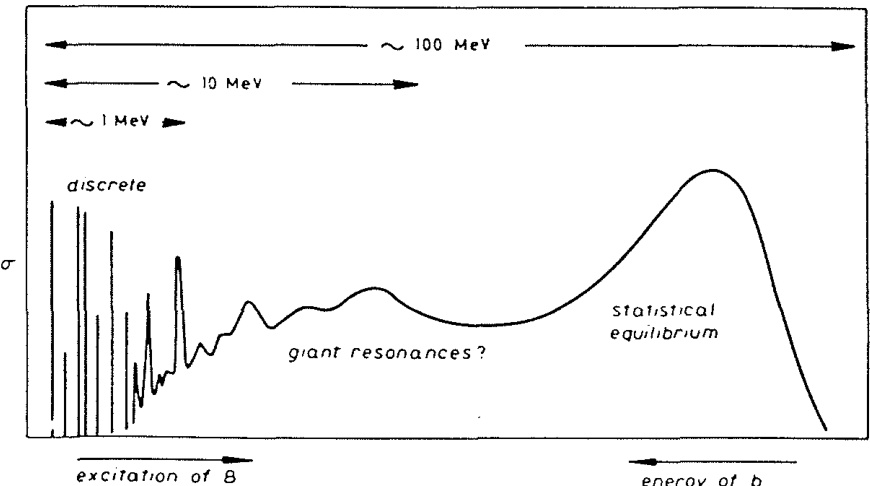
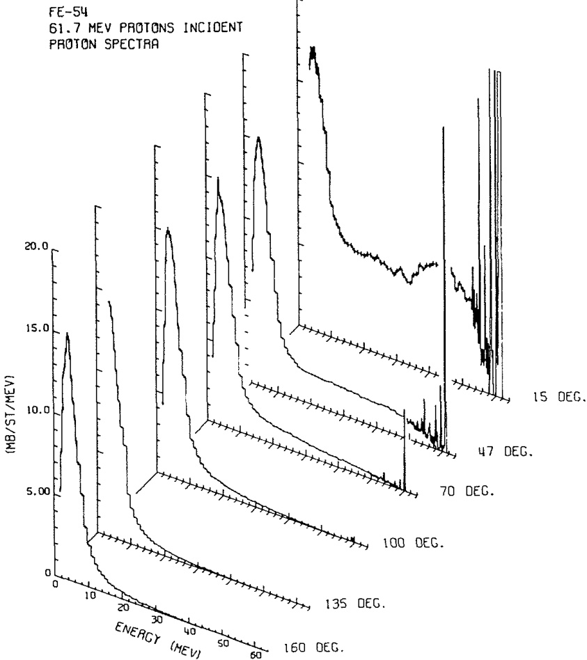

# 1.3. 直接反应的识别 (The identification of direct reactions)

从前文的讨论中可以清楚地看出，目前尚不存在明确无误的直接反应定义。尽管如此，讨论中已经强调了一些关键特征，这些特征可以作为初步判断特定反应在特定能量下是否具有直接性的标准。

已经提到，直接反应通常随着轰击能量的变化而表现出缓慢的变化趋势。然而，在某些特殊情况下，直接反应模型可能会导致振幅随能量快速变化。这种现象可能是由于光学势中的单粒子共振引起的。但这种情况非常罕见，通常仅在非常低的能量下才会观察到。此外，与其他开放通道的耦合（即由于吸收引起的阻尼效应）往往会抑制这些共振。因此，只有当观察到的截面随能量缓慢变化，或者通过某种合适的方式去除观察到的任何波动后，直接反应描述才可能适用。

直接反应的一个显著特点是其倾向于简单、一步完成的过程。这意味着在这种反应中，通常只会转移少量动量。因此，反应产物的角分布往往呈现不对称性，并且在前向方向上形成峰值（即向前峰化）。如果反应局限于核表面（即周边碰撞），则较大的角动量参与将使得角分布的峰值更加狭窄（在散射角上更加局域化）。线动量和角动量守恒的重要性将在下一节进一步展开讨论。

观察到角分布中前向峰化的结构，且该结构对能量变化具有稳定性，是判断某一反应是否为直接反应的良好指标。需要注意的是，随着能量的提高以及可用角动量数量的增加，这种前向峰化现象会变得更加明显。

粗略来说，反应中涉及的能量转移越大，它越不可能是直接反应。为了获得整体视角，图 1.2 展示了由能量约为 100 MeV 的粒子引发的某个反应 $A$($a$, $b$)$B$ 的产物“典型”能量谱。

- **低能粒子**：主要来源于达到统计平衡的复合系统蒸发。
- **高能粒子**：使系统处于离散的、低激发态，这些情况最可能是直接反应的结果。
- **过渡区域**：在低能和高能之间存在一个宽广的过渡区域。在这个区域中，预平衡统计模型（Blann 1975）或多步直接过程模型（Udagawa, Tamura, and Kim 1979）已被成功应用。然而，即使在这个区域，也可能存在相对简单的激发模式，例如巨共振（Satchler 1978）。这些激发可以通过主要是一步完成的直接过程来实现。

综上所述，直接反应的特征包括能量变化缓慢、动量转移小、角分布前向峰化等。这些特性为我们提供了判断某一反应是否为直接反应的重要依据。

  
图 1.2. 由能量约为 100 MeV 的炮弹$\alpha$引发的反应 $A(a,b)B$ 产生的激发能谱示意图。 

  
图 1.3 展示了用 62 MeV 质子轰击 ${}^{56}\mathrm{Fe}$ 后，在不同角度发射的质子能量谱。（数据来源：Bertrand and Peele, 1973。）

为避免读者被理论家的抽象概念所误导，图 1.3 展示了用 62 MeV 质子轰击 $^{54}\mathrm{Fe}$ 后，在不同角度发射的质子的实测谱。从图中可以看出，$15^{\circ}$ 处的谱与图 1.2 所示的示意谱非常相似。

- **低能质子**：其蒸发峰几乎呈现各向同性分布。
- **高能质子**：则表现出强烈的前向峰化现象，这是直接反应或半直接反应的典型特征。
- **角度依赖性**：随着散射角度的增加，能量最高的质子数量显著减少。

这些实验结果清楚地反映了直接反应和复合核反应的不同特性。

