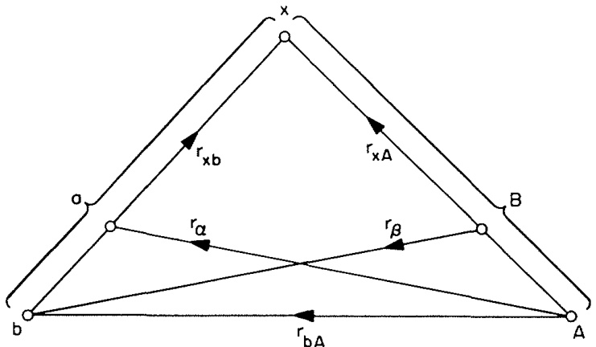

# 2.3. 总波函数与模型波函数 (Total wavefunction and model wavefunctions)

### 2.3.1 总波函数 (The total wavefunction)

系统的总波函数 $\Psi$ 满足完备的薛定谔方程 (Schrödinger equation)：

$$
(E - H)\Psi = 0.
$$

这个 $\Psi$ 可以用由 (2.1) 到 (2.3) 定义的任意一组完备内禀态 $\psi_{\alpha}$ 展开。例如，

$$
\Psi = \sum_{\alpha} \xi_{\alpha}(\mathbf{r}_{\alpha}) \psi_{\alpha}(x_{\alpha}),
$$

其中求和遍及某个特定划分 $\alpha$ 的所有内禀态。展开系数 $\xi_{\alpha}(\mathbf{r}_{\alpha})$ 描述了当原子核 $a$ 和 $A$ 处于由 $\psi_{\alpha}$ 描述的内禀态时它们的相对运动。

利用 $\psi_{\alpha}$ 的正交归一性 (orthonormality)，如 (2.4)，可以反演 (2.15) 得到：

$$
\xi_{\alpha}(\mathbf{r}_{\alpha}) = (\psi_{\alpha} | \Psi) \equiv \int \psi_{\alpha}^*(x_{\alpha}) \Psi \, \mathrm{d}x_{\alpha}.
$$

这表明 $\xi_{\alpha}$ 是 $\Psi$ 在 $\alpha$ 道上的投影（我们将使用圆括号表示仅对适当的内禀变量积分，这里是 $x_{\alpha}$）。

然而，尽管像 (2.15) 这样的展开形式看似简单，但其表面的简洁性可能具有误导性。对 $\alpha$ 的求和是完备的，包含了 $a$ 和 $A$ 在连续谱 (continuum) 中的状态，即 $a$ 或 $A$ 或两者未束缚 (unbound) 的状态。这些状态对于描述重排碰撞 (rearrangement collisions) 至关重要，而不仅仅是非弹性散射 (inelastic scattering) 对 $a + A$ 的激发。当两个原子核之间的距离显著大于它们半径之和时，如果 $\psi_a$ 和 $\psi_A$ 是束缚态（因此是定域化的），它们之间就没有交叠 (overlap)。因此，这些束缚态无法描述不同于 $a + A$ 的重排态 $b + B$。相比之下，连续谱态不是定域化的，可以用它们构建不同核对的波函数，尽管这样做并不方便。

连续谱态还描述了交换散射 (exchange scattering)，其中一个或多个核子在 $a$ 和 $A$ 之间交换。这种现象是一种重排形式，由于泡利原理 (Pauli principle) 要求 $\Psi$ 反对称化 (antisymmetrized)，因此必须发生。求和 (2.15) 中的非束缚态也描述了导致碎裂 (breakup) 成三个或更多体的反应。

此外，(2.15) 形式对于描述短程核子-核子关联 (short-range nucleon-nucleon correlations) 并不理想，例如由核子-核子力中的强短程排斥引起的那些关联。例如，硬核 (hard core) 会要求只要 $a$ 中的一个核子接近 $A$ 中的一个核子且距离小于硬核半径时，$\Psi$ 就为零。要描述这种情况，需要在 (2.15) 中包含 $a$ 和 $A$ 的许多高激发态。通常，我们通过引入有效相互作用 (effective interactions) 来避免这个问题，其中排斥核效应已被变换掉，并且微扰理论 (perturbation theory) 可能有效。然而，哈密顿量的任何此类变换都将伴随着波函数的相应变换，而这已经吸收了 (2.15) 中对应于高激发态的部分效应。事实上，构建这种变换的一种方法是将 $\Psi$ 投影到给定划分原子核的较低激发态上（见 2.9 节）。

在 (2.15) 中，对 $\alpha$ 的求和也可能包含 $a$ 和 $A$ 的束缚内禀态。对于这些态，$\varepsilon_{\alpha} > E$，因此与 $\xi_{\alpha}(\mathbf{r}_{\alpha})$ 相关联的动能渐近为负。也就是说，这些项代表了在能量 $E$ 下碰撞的闭合道 (closed channels)，其中 $a$ 和 $A$ 相互束缚，因此在空间上是定域的。当然，这些组态在碰撞过程中仅以瞬时（虚 (virtual)）方式实现，并且是复合核形成 (compound-nucleus formation) 描述的一部分。

### 2.3.2 模型波函数 (Model wavefunctions)

从前述讨论中可以看出，在实践中我们无法使用完整的、无限的展开式 (2.15)。相反，我们通常取入射道加上一小组项，在这些项中 $a$ 和 $A$ 都是“束缚”的，并且与入射道强耦合。我们可以将其视为一个模型波函数 $\Psi_{\text{model}}$，与有效相互作用结合使用：

$$
\Psi_{\text{model}} = \sum_{\alpha} u_{\alpha}(\mathbf{r}_{\alpha}) \psi_{\alpha}(x_{\alpha}),
$$

其中撇号表示有限求和。(2.17) 中包含的项通常对应于开放道 (open channels)，但有时包含一个或多个闭合道也可能有用。

我们将经常遇到使用模型波函数 (model wavefunction) 的想法（Austern 1970），而不是采用形式上精确但完全通用但在实践中用处不大的表达式。由于我们只在 $\Psi_{\text{model}}$ 中包含少数项，而精确的 $\Psi$ 包含无限多项，因此该模型可能只代表总波函数的一小部分。模型部分与其余部分之间的耦合通过使用有效相互作用（特别是复数光学势）以平均方式表示。

在 (2.17) 中，我们用 $u_{\alpha}$ 表示模型的相对运动函数，以认识到它可能与 (2.15) 中的精确函数 $\xi_{\alpha}$ 不同。即使 $\Psi_{\text{model}}$ 在这些道中描述的散射与完整波函数 $\Psi$ 相同，这也仅要求 $u_{\alpha}$ 和 $\xi_{\alpha}$ 在大 $\mathbf{r}_{\alpha}$ 处具有相同的渐近行为 (asymptotic behaviour)：它们在小 $\mathbf{r}_{\alpha}$ 处的短程行为可能差异很大。

模型 (2.17) 仅包含划分 $\alpha$ 的有限数量的束缚态。正如前面讨论的，这些不足以描述重排碰撞（例如，两个不同划分之间的跃迁 $\alpha \to \beta$）。因此，模型波函数的概念通常被推广以包含来自两个或更多划分的项：

$$
\Psi_{\text{model}} = \sum_{\alpha}^{\prime} u_{\alpha}(\mathbf{r}_{\alpha}) \psi_{\alpha}(x_{\alpha}) + \sum_{\beta}^{\prime} u_{\beta}(\mathbf{r}_{\beta}) \psi_{\beta}(x_{\beta}) + \cdots.
$$

正如我们将在 2.3.3 节中看到的，来自不同划分的波函数不是正交的 (orthogonal)。当使用像 (2.18) 这样的混合表象 (mixed representation) 时，必须考虑到这一点。定义模型波函数及其相关有效相互作用的一种便捷方法是使用投影算符 (projection operators)，如 2.9 节所述。

### 2.3.3 不同划分的非正交性 (Nonorthogonality of different partitions)

诸如 (2.15) 这样将 $\Psi$ 展开到不同划分 $\alpha$ 和 $\beta$ 的两个展开式中的典型项，例如 $\xi_{\alpha}(\mathbf{r}_{\alpha}) \psi_{\alpha}(x_{\alpha})$ 和 $\xi_{\beta}(\mathbf{r}_{\beta}) \psi_{\beta}(x_{\beta})$，是不正交的。例如，交叠

  
图 2.1 转移反应 $a(=b+x) + A \to b + B(=A+x)$ 的坐标示意图

$$
{\cal O}_{\alpha\beta} = \int \psi_{\alpha}^*(x_{\alpha}) \psi_{\beta}(x_{\beta}) \, \mathrm{d}x_{\alpha} \neq 0.
$$

相反，由于涉及不同的内禀变量 $x_{\alpha}$ 和 $x_{\beta}$，其中 $x_{\beta} = x_{\beta}(x_{\alpha}, r_{\alpha})$，该交叠仍然是道变量的函数；即 ${\cal O}_{\alpha\beta} = {\cal O}_{\alpha\beta}(\mathbf{r}_{\alpha})$。此外，${\cal O}_{\beta\alpha} \neq {\cal O}_{\alpha\beta}$。

这可以通过一个简单的三体模型 (three-body model)（见图 2.1）来说明，该模型稍后将用作诸如氘核剥离等转移反应的模型。假设我们有原子核 $A$ 和 $a = b + x$ 作为划分 $\alpha$，原子核 $b$ 和 $B = A + x$ 作为划分 $\beta$。那么，如果三个粒子 $a, b$ 和 $x$ 是无结构且无自旋的，内禀变量 $x_{\alpha}$ 就是矢量 $\mathbf{r}_{xb}$，$x_{\beta}$ 就是 $\mathbf{r}_{xA}$。那么交叠 (2.19) 简化为

$$
{\cal O}_{\alpha\beta} = \int \psi_{a}^*(\mathbf{r}_{xb}) \psi_{B}(\mathbf{r}_{xA}) \, \mathrm{d}\mathbf{r}_{xb}.
$$

由于（见图 2.1）我们有关系 $\mathbf{r}_{xA} = \mathbf{r}_{\alpha} + (\mathfrak{M}_b / \mathfrak{M}_a) \mathbf{r}_{xb}$，显然 ${\cal O}_{\alpha\beta}$ 仍然是 $\mathbf{r}_{\alpha}$ 的函数。然而，波函数 $\psi_a$ 和 $\psi_B$ 代表束缚态，因此它们局限于特定的空间区域，并以指数方式渐近衰减。因此，当 $\mathbf{r}_{\alpha} \to \infty$ 时，${\cal O}_{\alpha\beta}(\mathbf{r}_{\alpha}) \to 0$。所以非正交性局限于原子核交叠的区域。同样的性质对一般情况 (2.19) 也成立。在这个意义上，可以说不同划分的内禀态是渐近正交的 (asymptotically orthogonal)。

如果我们对模型波函数使用像 (2.18) 这样的混合表象，这种非正交性可能很重要。例如，如果我们试图将这个 $\Psi_{\text{model}}$ 投影到 $\alpha$ 划分的一个态上，我们得到：

$$
(\psi_{\alpha} | \Psi_{\text{model}}) \equiv \int \psi_{\alpha}^*(x_{\alpha}) \Psi_{\text{model}} \, \mathrm{d}x_{\alpha} = u_{\alpha}(\mathbf{r}_{\alpha}) + \sum_{\beta} (\psi_{\alpha} | u_{\beta} \psi_{\beta}).
$$

非正交项 $(\psi_{\alpha} | u_{\beta} \psi_{\beta})$ 并不简单地与 (2.19) 的 ${\cal O}_{\alpha\beta}$ 成正比，因为 $u_{\beta}(\mathbf{r}_{\beta})$ 也依赖于 $x_{\alpha}$。这通过刚才讨论的图 2.1 的三体模型很容易看出，因为在那里 $x_{\alpha} = \mathbf{r}_{xb}$ 并且 $\mathbf{r}_{\beta} = (\mathfrak{M}_A / \mathfrak{M}_B) \mathbf{r}_{\alpha} - [\mathfrak{M}_x (\mathfrak{M}_a + \mathfrak{M}_A) / \mathfrak{M}_a \mathfrak{M}_B] \mathbf{r}_{xb}$。

如果我们使用了精确的 $\Psi$，那么在 $\alpha$ 道上的投影就简单地是 $\xi_{\alpha}(\mathbf{r}_{\alpha})$。这再次表明，当原子核交叠时，模型 $u_{\alpha}$ 和精确的 $\xi_{\alpha}$ 未必相同。导致 ${\cal O}_{\alpha\beta}(\mathbf{r}_{\alpha})$ 渐近消失的相同论证也意味着 $(\psi_{\alpha} | u_{\beta} \psi_{\beta})$ 同样如此。因此，$(\psi_{\alpha} | u_{\beta} \psi_{\beta})$ 局限于原子核交叠的区域；然而，正是在这个区域，相互作用发生并对跃迁振幅的表达式做出贡献。正如我们稍后将看到的，如果我们将接下来几节描述的操作应用于 (2.18) 的模型波函数，方程中会出现额外的非正交修正项 (nonorthogonality correction terms)。我们还将看到，考虑非正交性会导致在识别相互作用 $V_{\alpha}$ 不同阶项时出现一些歧义。